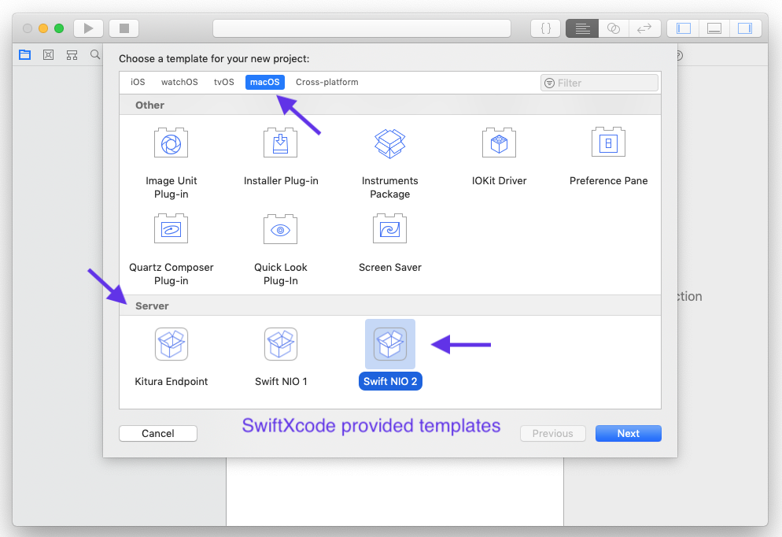
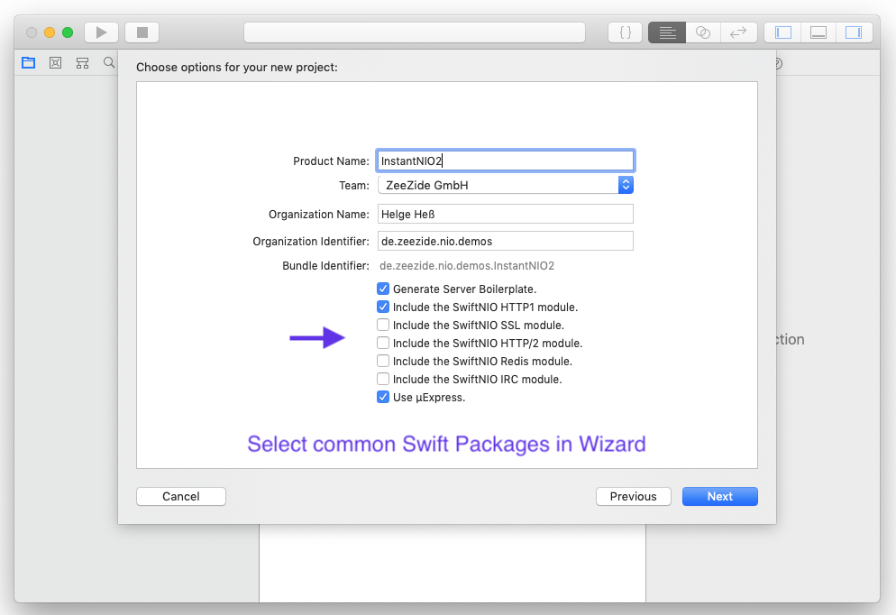
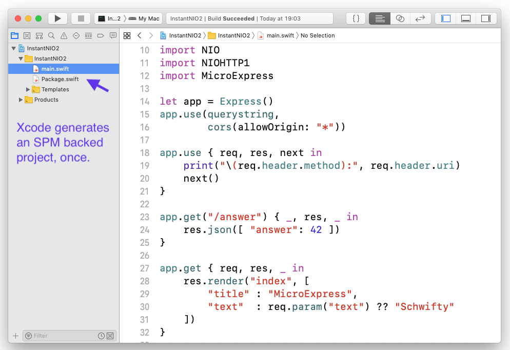

<p>
  
  
  
  
  
  
  
</p>

Use 
[Swift Package Manager](https://swift.org/package-manager/),
packages directly from within Xcode,
w/o having to jump to the Terminal.
With swift builds, in a non-annoying way.
Build large dependencies once, not again and again for every project.
Do not require an Internet connection just to create a new project.

<p style="text-align: right;"><i>... hopefully getting sherlocked soon!</i></p>

Too much text? Want a GIF? [Here you go](#what-it-looks-like-).

## Goals

### 1. Use Swift Package Manager directly from within Xcode

State of the art (duration: some minutes or more):
1. Open terminal.
2. Call `mkdir MyProject`. Do a `cd MyProject`.
3. Call `swift package init`, `kitura init`, or something similar.
4. Call `swift package generate-xcodeproj` to create the Xcode project.
5. Open `MyProject.xcodeproj`, find and select the right scheme
6. Build and Run.
You need to add a package? Start again at step 4, sometimes 3.

Goal (duration: a few seconds):
1. Create a project from within Xcode. (Cmd-Shift-N, follow wizard)
2. Build and run. Works.
You need to add a package? Just edit `Package.swift` and build.





### 2. Reduce Compile Time

Calling `swift build` as a tool takes some second(s).

Goal:
Instead of doing calling `swift build` on every build,
do a `swift build` only when the `Package.swift` file is changed.
Produces a static library (pretty big, bundles up all the packages),
which is directly linked against the Xcode target.

Changing a source file:


### 3. Reduce *Initial* Compile Time

State of the art:
When you create a new Swift Package Manager project,
for instance a Kitura endpoint,
the initial setup takes a long time:
1. all the required packages are resolved and fetched from the Internet
2. all those packages are built from source

For a plain Kitura HelloWorld this is about 3-5 minutes before you can get
going, even on a fast machine.

But worse: This has to be done every single time you create a new project!
Want to create HelloKitten? Another 3mins lost. HelloCow? Again.

Goals, alongside goal 1:
1. Create a project from within Xcode. (Cmd-Shift-N, follow wizard)
2. Edit your main.swift or whatever
3. Build and run. Only build your own project sources.

Build time on first build, straight after project creation:


#### 3.1. Bonus: Do not require Internet to create new projects

Internet is only required when you install an image, once.
After that, the bundled image is available and as many projects as desired
can be created.


## Installation

```shell
brew tap swiftxcode/swiftxcode
brew install swift-xcode
swift xcode link-templates # <-- important!
```

### Extra Images

Images are pairs of Xcode templates and precompiled Swift packages 
(used by those templates).
The precompilation happens when you install a Homebrew image formula
(or manually using the GIT repo) and can take some time.
Afterwards you can create new Xcode projects using those templates,
without having to wait for the SPM bootstrap (fetch and compilation
of the dependencies).

You can find the available images over here:
[Swift Packages within Xcode](https://github.com/SwiftXcode),
this includes:

- SwiftNIO 2 (`brew install swift-xcode-nio-2`)
- Kitura (`brew install swift-xcode-kitura`)
- SwiftObjects (`brew install swift-xcode-wo`)
- SwiftNIO 1 (`brew install swift-xcode-nio-1`)
- Old: SwiftServerAPI (`brew install swift-xcode-server-api`)

After installing an image, always run `swift xcode link-templates` so that
Xcode can find the templates.

#### Image: Kitura

(One time) compile time: ~5 minutes. Image size: ~100MB.
Fresh project setup from create to run: 3 seconds.

```shell
brew install swift-xcode-kitura
swift xcode link-templates # <-- important!
```

A blog post with all the details:
[Instant Kitura with SwiftXcode](http://www.alwaysrightinstitute.com/swift-xcode-kitura/).

## Using it for iOS Projects

Here is the basic version:

1. Create new Project in Xcode (File Menu / New / Project)
2. Select iOS / Swift Package Manager App
3. Give it a name, optionally preconfigure SPM modules you want
4. Build project (can take a moment w/o an image)
5. In Package.swift, add modules as you wish, e.g. `cows`
6. in AppDelegate.swift, `import cows`, do `print(cows.vaca())`
7. Build project and run

## Comparison w/ other Package Managers

Note that `swift-xcode` is not really a package manager on its own.
The package manager is still the official
[Swift Package Manager](https://swift.org/package-manager/),
just enhanced a little.

So you inherit a lot of its limitations.
For example it cannot deal with resources,
produce frameworks, or bundles.
Yet, you can still build reusable modules with it.

So is it a replacement for Cocoa Pods or Carthage?
In some cases it can be. In other cases it can't :-)

### What it looks like ...

Build a Mobile Cows application in 3 minutes:


### Documentation

Documentation can be found here:
[SwiftXcode.github.io/docs/](https://SwiftXcode.github.io/docs/).
